# Orbit Propagation: Two-Body Problem and Kepler's Equation

*Individual project · AE 311 · Izmir University of Economics · Dec 2025 – Jan 2026*

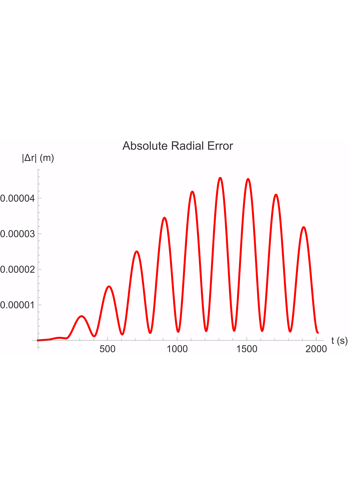

## Engineering question
How accurate is numerical two-body integration compared with the analytical Kepler solution, and how does analytical Keplerian propagation compare with numerical integration for a real satellite?

## Approach
- Project 1: numerical solution of the radial and angular two-body equations for Mercury's orbit, compared with the analytical orbit.
- Project 2: Kepler's equation solved numerically and applied to the Moroccan satellite UM5-EOSAT using real TLE data; analytical Keplerian propagation compared with numerical two-body integration.
- Extension to a translunar Hohmann transfer (patched conics) and restricted three-body Earth–Moon dynamics.

## Results
- Quantified numerical error in conserved quantities (energy, angular momentum) and in position.
- Quantified the discrepancy between analytical and numerical propagation and its sensitivity to numerical accuracy and precision.

## Validation
Analytical benchmark comparison and conservation-law checks.

## Figures
Figures are taken from the two reports (figure numbers and captions as in each report). The PDF originals are kept in `figures/` next to each PNG.

**Project 1: Mercury two-body problem**

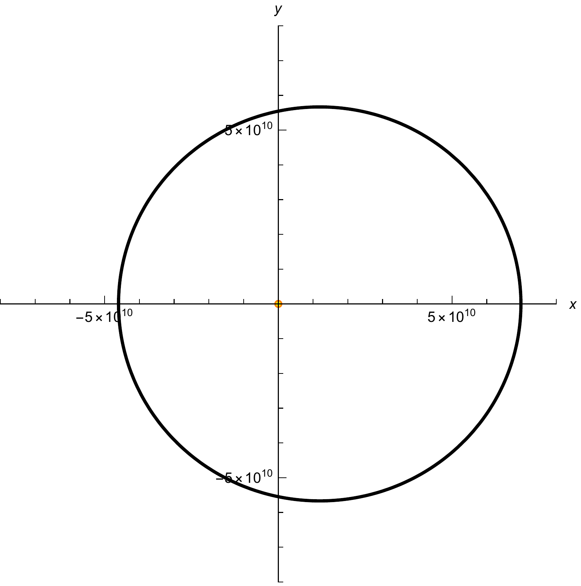
*Project 1, Figure 1: Classical numerical solution of Mercury's orbit.*

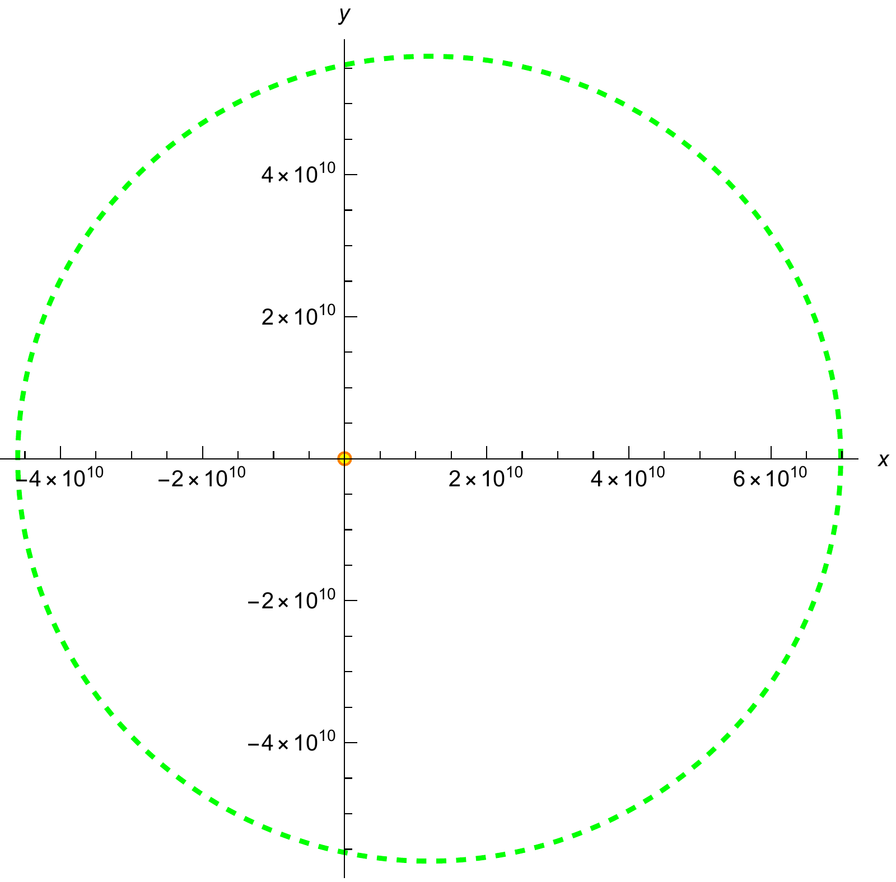
*Project 1, Figure 2: Analytical Keplerian trajectory plotted using the closed-form expression for r(θ).*

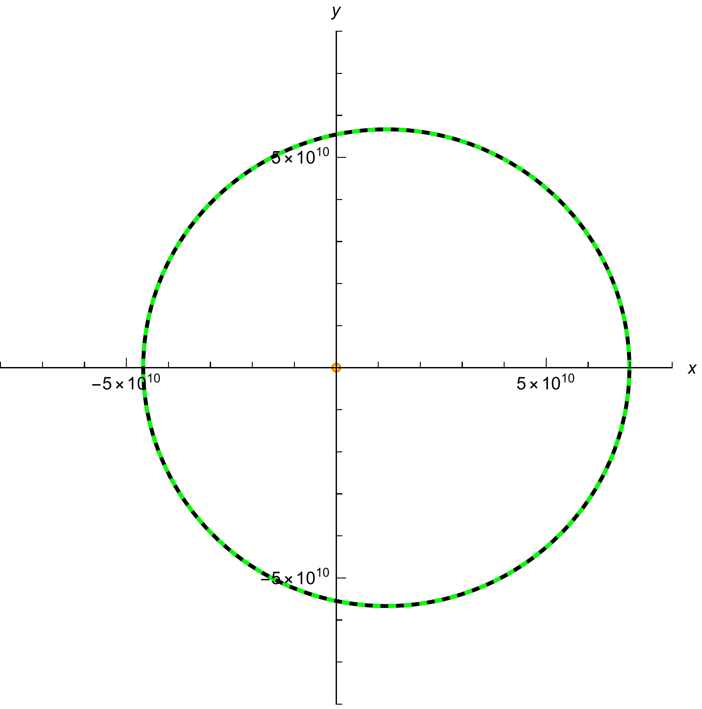
*Project 1, Figure 3: Superposition of analytical, classical numerical and symplectic trajectories.*

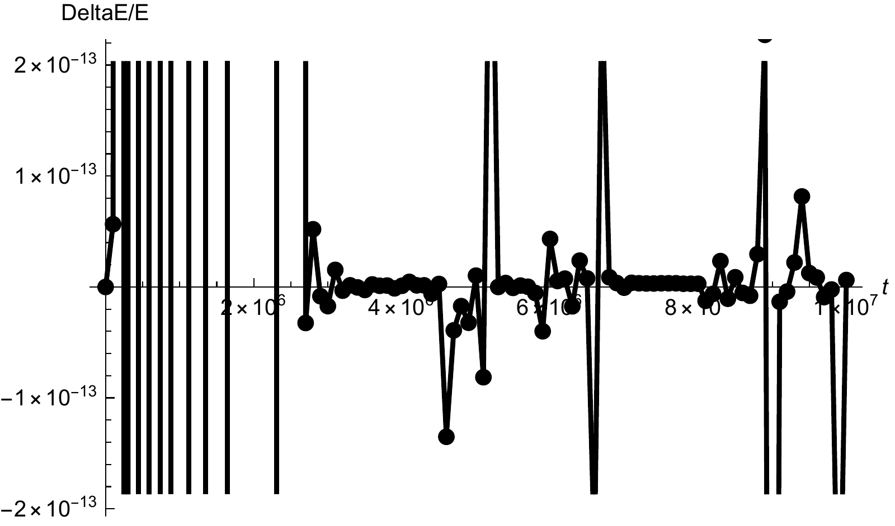
*Relative energy error ΔE/E of the numerical solution (conserved-quantity check, Project 1, Section 4).*

*Project 1, Figure 6: Comparison of Mercury orbital periods obtained from analytical, Runge-Kutta and symplectic methods. Relative errors are computed with respect to the analytical period.*

**Project 2: UM5-EOSAT and Earth–Moon transfer**

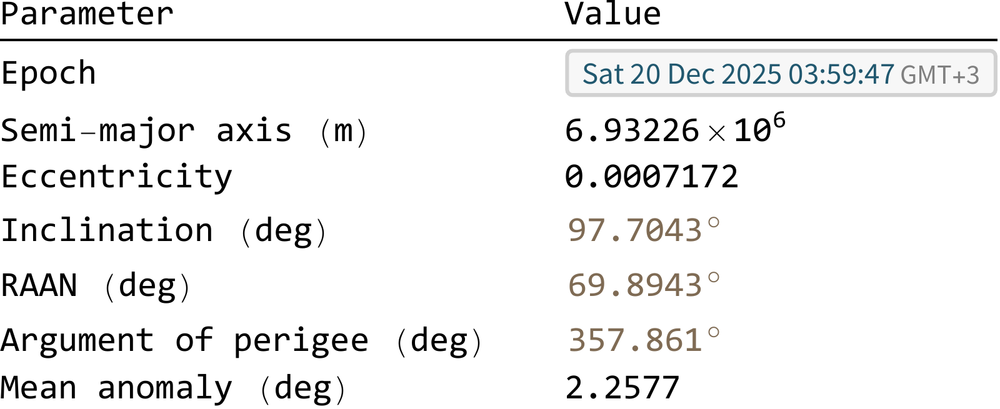
*Project 2, Figure 1: Orbital parameters of UM5-EOSAT at epoch (derived from TLE).*

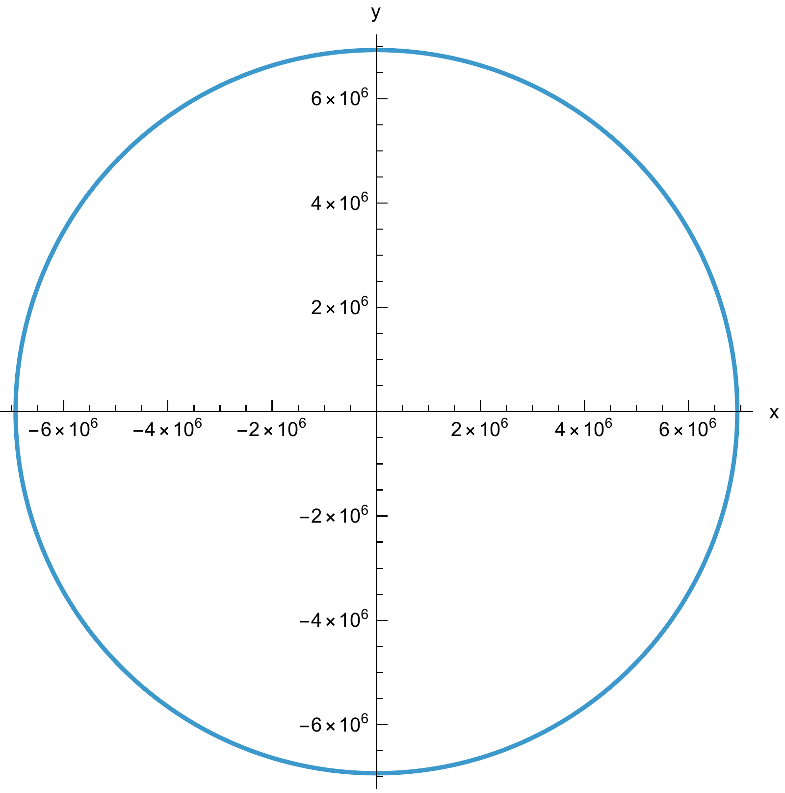
*Project 2, Figure 2: Orbit plane and spacecraft trajectory of UM5-EOSAT obtained using analytical Keplerian propagation.*

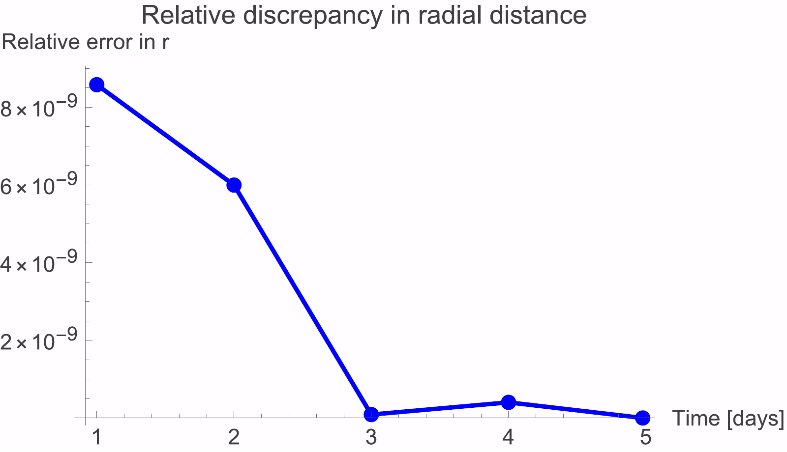
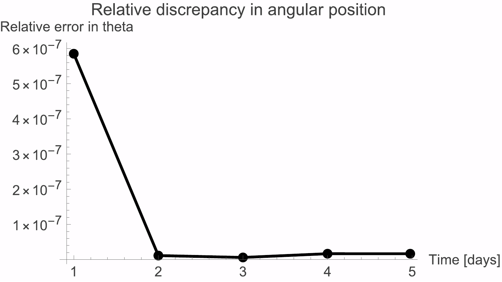
*Project 2, Figure 3: Relative discrepancies in radial distance and angular position between analytical Keplerian propagation and numerical two-body integration.*

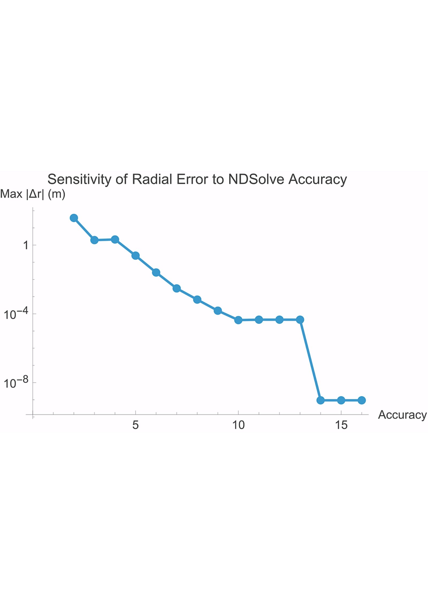
*Project 2, Figure 4 (panel): dependence of the analytical–numerical radial discrepancy on the numerical accuracy setting.*

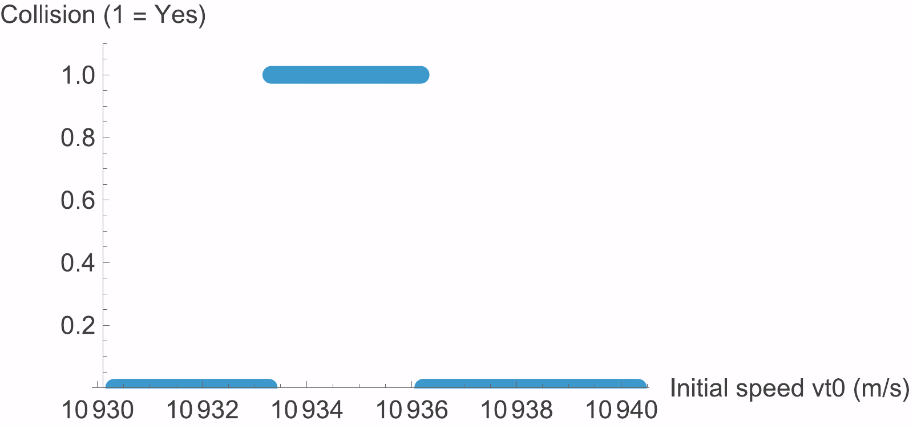
*Project 2, Figure 6: Restricted three-body analysis showing the range of initial tangential velocities leading to lunar collision. Impact trajectories occur only within the narrow window 10933.3 m/s < vt0 < 10936.2 m/s.*

All other figures used in the two reports are also in `figures/`, as PDF with a PNG copy.

## Repository contents
- `notebooks/`: Wolfram Language Jupyter notebooks (outputs saved, so results display directly on GitHub)
- `report/`: written reports (PDF)
- `figures/`: report figures (PDF originals with PNG copies for display on GitHub)
- `data/60555.tle` (identical copy: `data/UM5-EOSAT.txt`): UM5-EOSAT two-line element set (NORAD 60555) used in Project 2
- `data/kaoutar-ammara-report-fig-11-TABLE.svg`: results table exported as vector graphics
- `code/kaoutar-ammara-fall-2025-ae-311-project-2-GMAT.script`: GMAT script for the restricted three-body Earth–Moon collision sensitivity study (opens in [GMAT](https://sourceforge.net/projects/gmat/))

## How to run
The notebooks use the Wolfram Language kernel for Jupyter (WolframLanguageForJupyter, Wolfram Engine or Mathematica 14).

Project 2 imports a TLE file (NORAD 60555, UM5-EOSAT). The TLE used in the report is now included in `data/`; update the file path in the notebook to point to it, or download a current TLE to propagate from a newer epoch. The GMAT collision study runs directly in GMAT.

## Credits
This project was completed on a course notebook framework by **Prof. Fabrizio Pinto** (Izmir University of Economics), released under CC BY 4.0. The completed notebook, results and written report in this repository are my own work.

## License
CC BY 4.0, consistent with the original course material. Please credit both Prof. Fabrizio Pinto and Kaoutar Ammara.

---
Kaoutar Ammara · Aerospace Engineer · [GitHub](https://github.com/Kiwiiiieee) · [LinkedIn](https://linkedin.com/in/kaoutar-ammara)
